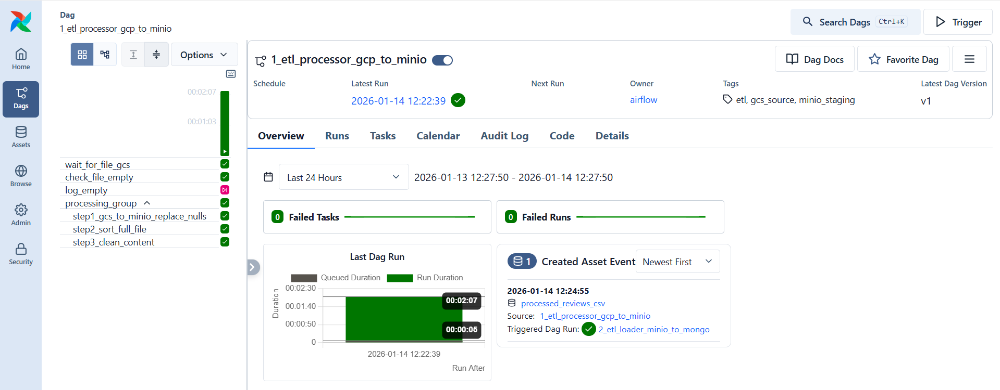
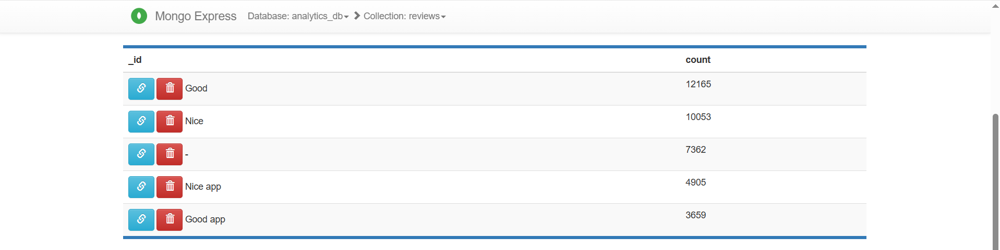
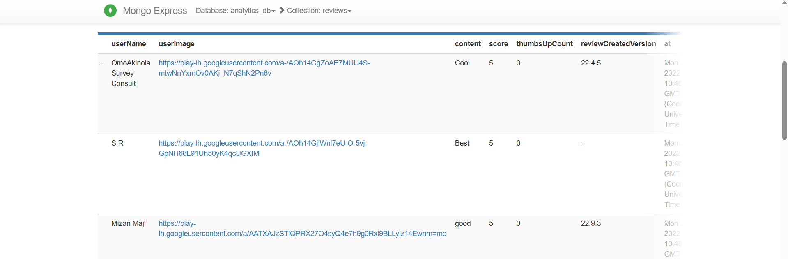
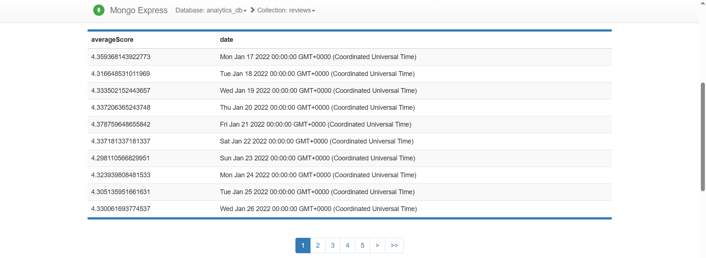

## GCS to MongoDB ETL Pipeline with Airflow and MinIO Staging

This project is a fault-tolerant ETL-process built upon **Airflow 3.1.5** that transmits and processes data from cloud storage **(GCS)** to NoSQL data base **(MongoDB)** via intermediate staging **(MinIO)**.

### Architecture overview of data process in Airflow

The project is divided into two independent DAGs, linked through the **Asset-Aware Scheduling** mechanism:

1. **DAG 1: Processor** `1_etl_processor_gcp_to_minio`:
  - **Sensor:** `GCSObjectExistenceSensor` waits for the file to appear in the GCS bucket.
  - **Branching:** Checking the file size, if empty, error logging is performed, if not - processing is started.
  - **TaskGroup (`processing_group`):**
    + `Step 1`: Replacing `null` values with `-`. Saving to MinIO.
    + `Step 2`: Date conversion and sorting by the `at` column. Saving to MinIO.
    + `Step 3`: Clearing text from emojis and special characters. Final export to MinIO.



2. **DAG 2: Loader** `2_etl_loader_minio_to_mongo`:
  - Starts via `schedule=[processed_asset]`.
  - Cleans up the `reviews` collection of `analytics_db` in MongoDB and downloads fresh data from MinIO.


### Project Startup and Workflow

#### 1. Building a custom image

The extended Airflow image is used to work with S3, GCS, and MongoDB:

```bash
docker build -t extended_airflow:3.1.5 ./docker-airflow

```

#### 2. Environment preparation

Create a `.env` file based on your credits and make sure that `google_creds.json` is located at the root of the project.

#### 3. Launching containers

```bash
docker-compose -f docker-compose-minio.yaml up -d
docker-compose -f docker-compose-mongo.yaml up -d
docker-compose -f docker-compose-airflow up airflow-init
docker-compose -f docker-compose-airflow up
```

#### 4. Accessing Airflow UI

Go to [http://localhost:8080](http://localhost:8080). Tap the Dags icon on the left and on the main screen you will see two DAGs:

- `1_etl_processor_gcp_to_minio`
- `2_etl_loader_minio_to_mongo`

#### 5. ETL Pipeline Execution

Run DAG `1_etl_processor_gcp_to_minio` and upload `tiktok_google_play_reviews.csv` to GCS.  
Check [http://localhost:9001](http://localhost:9001) for intermediate files in the MinIO staging bucket.


#### 6. Loading & Verification

Updated Asset triggers `2_etl_loader_minio_to_mongo` automatically.  
Check `analytics_db.reviews` via Mongo Express [http://localhost:8081](http://localhost:8081).


#### 7. Logging

The project implements custom logging. Check them via:

- **Airflow UI Logs** - Standard Stream
- **Custom Report File:** - `/logs/custom-logs/etl_gcs_mongo_report.log`

### MongoDB Aggregation Queries

Once the data is moved to MongoDB, you can run the following queries in the Aggregations tab in Mongo Express:

#### 1. Top 5 frequently occurring comments

```json
[
  { "$group": { "_id": "$content", "count": { "$sum": 1 } } },
  { "$sort": { "count": -1 } },
  { "$limit": 5 }
]
```



#### 2. All entries where the “content” field is less than 5 characters long

```json
[
  { "$match": { "$expr": { "$lt": [{ "$strLenCP": "$content" }, 5] } } }
]
```



### 3. Average rating for each day (the result is in timestamp type)

```json
[
  { "$group": {
      "_id": { "$dateTrunc": { "date": "$at", "unit": "day" } },
      "averageScore": { "$avg": "$score" }
    }
  },
  { "$project": { "_id": 0, "date": "$_id", "averageScore": 1 }
  },
  { "$sort": { "date": 1 } }
]
```



### Technologies used

* **Orchestration:** Airflow 3.1.5
* **Storage (Source):** Google Cloud Storage (GCS)
* **Storage (Staging):** MinIO (S3-compatible)
* **Database (Target):** MongoDB 8.2.3 + Mongo Express
* **Processing:** Python 3.12, Pandas 2.3.3
* **Infrastructure:** Docker Compose